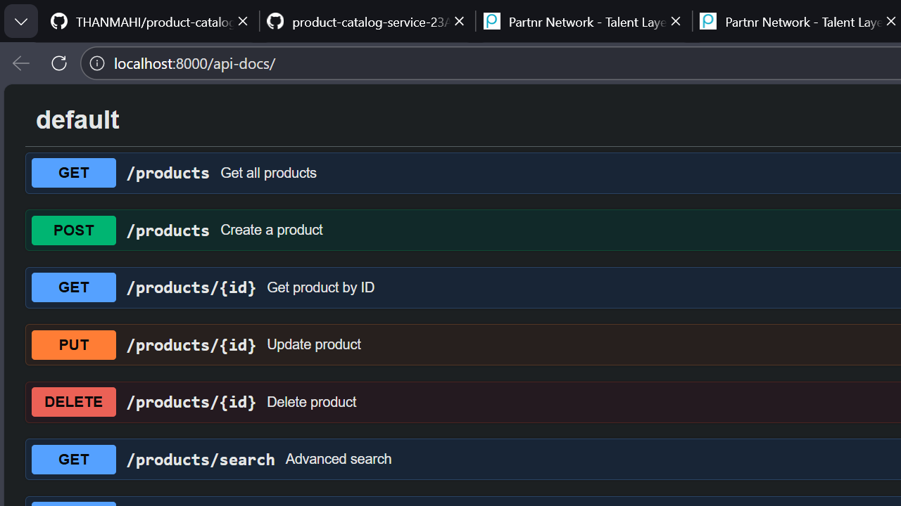
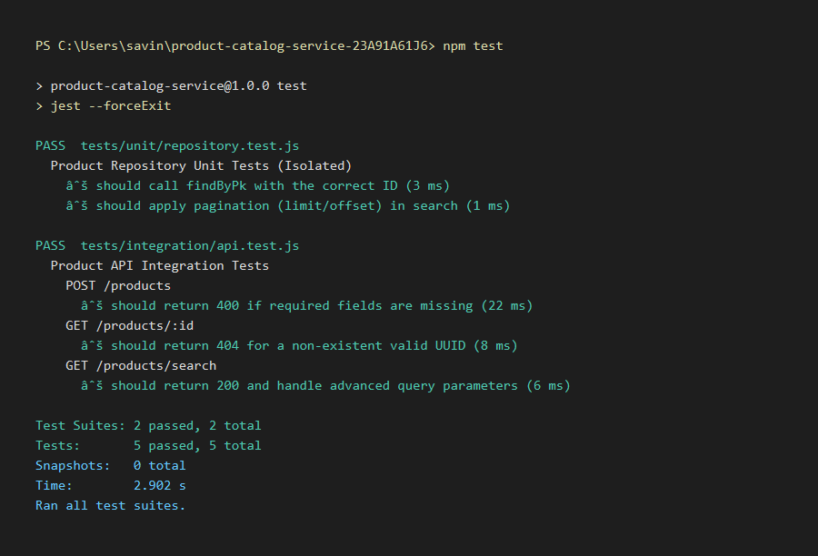

# Product Catalog Service

A robust Node.js microservice for managing an e-commerce product catalog using the **Repository Pattern** and **Unit of Work**.

##  Features
- **Clean Architecture:** Separation of concerns using Service and Repository layers.
- **Advanced Search:** Filter by keyword, price range, and category.
- **Transactional Integrity:** Managed via the Unit of Work pattern.
- **Auto-Seeding:** Database is pre-populated with 10 products and 3 categories.
- **Dockerized:** One-command setup.

## 🛠️ Tech Stack
- **Runtime:** Node.js (Express.js)
- **Database:** PostgreSQL
- **ORM:** Sequelize
- **Infrastructure:** Docker & Docker Compose

## 🚦 Getting Started
1. Ensure you have **Docker Desktop** installed.
2. Clone the repository and navigate to the folder.
3. Run the following command:
   ```bash
   docker-compose up --build
    ```
4. Access the API at http://localhost:8000

## API Endpoints

- GET /products : Get all products (paginated)
- GET /products/search?q=laptop&minPrice=1000 : Advanced Search
- POST /products : Create a product
- GET /products/:id : Get product details

## Architectural Overview
This service is engineered with a strict Separation of Concerns to ensure maintainability and testability. By decoupling the business logic from the persistence layer, the system achieves high modularity.

### 1. Repository Pattern
All data access for Products and Categories is abstracted through a Repository layer. This prevents the Service layer from having any direct dependency on the ORM (Sequelize) or raw SQL, allowing for easier data-source swapping in the future.

### 2. Unit of Work (UoW)
To guarantee Atomicity, a Unit of Work pattern is utilized. This is critical during complex operations—such as creating a product and simultaneously associating it with multiple categories.

- **Commit**: Saves all changes within a transaction.

- **Rollback**: Reverts all changes if a single operation in the chain fails, preventing "partial data" or orphaned records.


### 3. Service Layer
Acts as the "Brain" of the application. It orchestrates the Unit of Work and Repositories to execute business rules (e.g., SKU validation, price calculations) before data reaches the persistence layer.

## Database Design & Indexing
The system uses a relational schema designed for many-to-many relationships and high-performance retrieval.

### Schema : 

- **Products**: Primary catalog data with UUIDs for secure resource referencing.

- **Categories**: Hierarchical metadata for organization.

- **ProductCategories**: Junction table ensuring relational integrity between products and categories.

#### Query Optimization:

- **B-Tree Indexes:** Applied to SKU and Price fields to accelerate range filters and unique lookups.

- **Case-Insensitive Searching**: Utilizes iLike operators for keyword matching across name and description fields.

### Example POST Request (`/products`)
```json
{
  "name": "Wired Gaming Mouse",
  "price": 49.99,
  "sku": "MOU-RGB-001",
  "categoryIds": ["uuid-of-electronics"]
}
```

## API Documentation (Swagger)
- URL: http://localhost:8000/api-docs.


## Testing Instructions
Command: npm test.

Scope: Includes Unit Tests for repository logic and Integration Tests (using Supertest) for verifying API status codes (201, 400, 404).


## API Endpoints Examples

Search Example: GET /products/search?q=Mouse&maxPrice=50.

Expected Response: A JSON object containing { count: n, rows: [...] }.